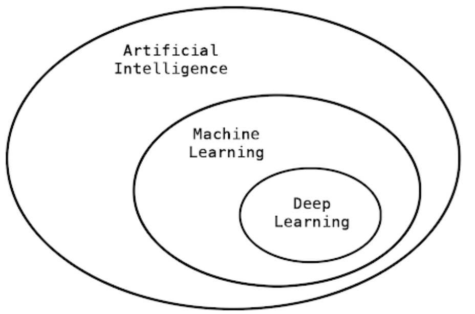

class: middle, center, inverse

# Introdução ao Deep Learning com R

### Curso-R

```{r setup, include=FALSE}
knitr::opts_chunk$set(eval = TRUE, echo = FALSE, 
                      dpi = 96, fig.height = 4.7, 
                      fig.width = 10, fig.retina = 3)
library(tidyverse)
```

---
## Nesse curso vamos falar de

TODO

---

## O que é Deep learning?

-   Subconjunto de técnicas de Machine Learning



Fonte: Deep Learning with R, Chollet, F et al

---
## O que é Deep learning?

- Aprender representações dos dados em camadas. Aprender representações dos dados 'hierarquicamente'. 


Fonte: Deep Learning with R, Chollet, F et al

---

## Por que Deep Learning

-   Estado da arte em diversos problemas muito importantes.


Fonte: [Apr. resultados ILSVRC 2017](http://image-net.org/challenges/talks_2017/ILSVRC2017_overview.pdf)

---

## Regressão Linear

Prevendo o preço de uma casa a partir do tamanho em metros quadrados.

```{r}
df <- tibble(
  m2 = rgamma(n = 100, scale = 5, shape = 20),
  preco = (7200 + rnorm(n = 100, sd = 800)) * m2 
)

ggplot(df, aes(x = m2, y = preco)) +
  geom_point() +
  coord_cartesian(ylim = c(0, NA)) +
  scale_y_continuous(
    name = "Preço (em R$)",
    labels = scales::dollar_format(prefix = "R$", big.mark = ".", decimal.mark = ",")
    
    ) +
  scale_x_continuous(name = "Área (em mˆ2)")
```

## Grafo de computação

```{r}
nomnoml::nomnoml(
  "
  [x]->[y_hat = wx + b]
  [w]->[y_hat = wx + b]
  [b]->[y_hat = wx + b]
  [y_hat = wx + b]->[loss = (y - y_hat)^2]
  [y]->[loss = (y - y_hat)^2]
  "
)
```

## SGD (Stochastic gradient descent)