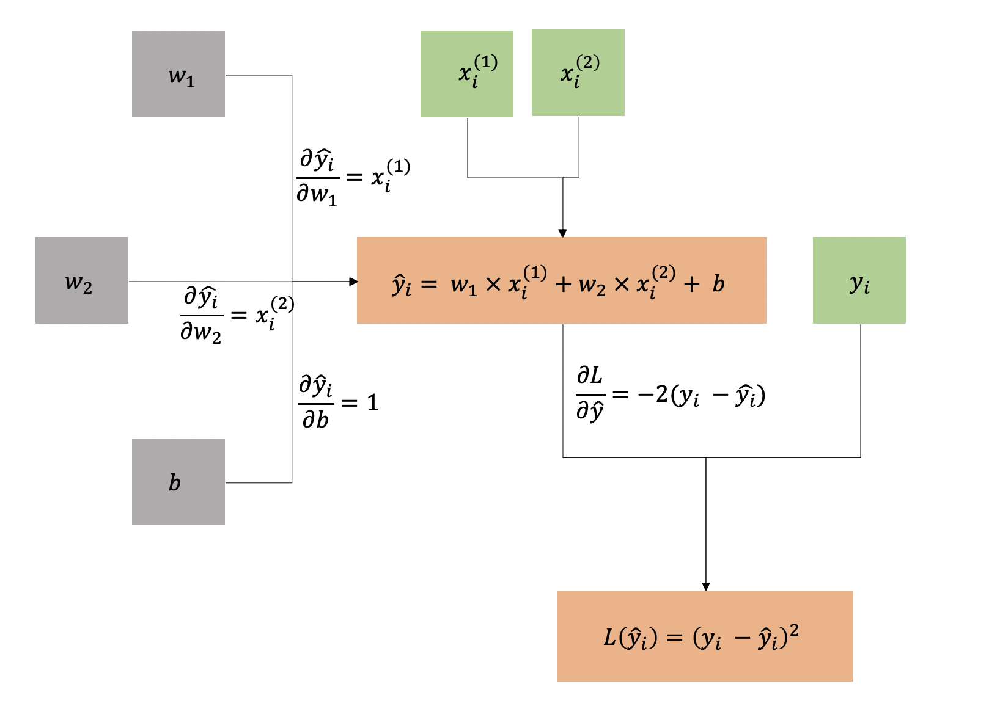
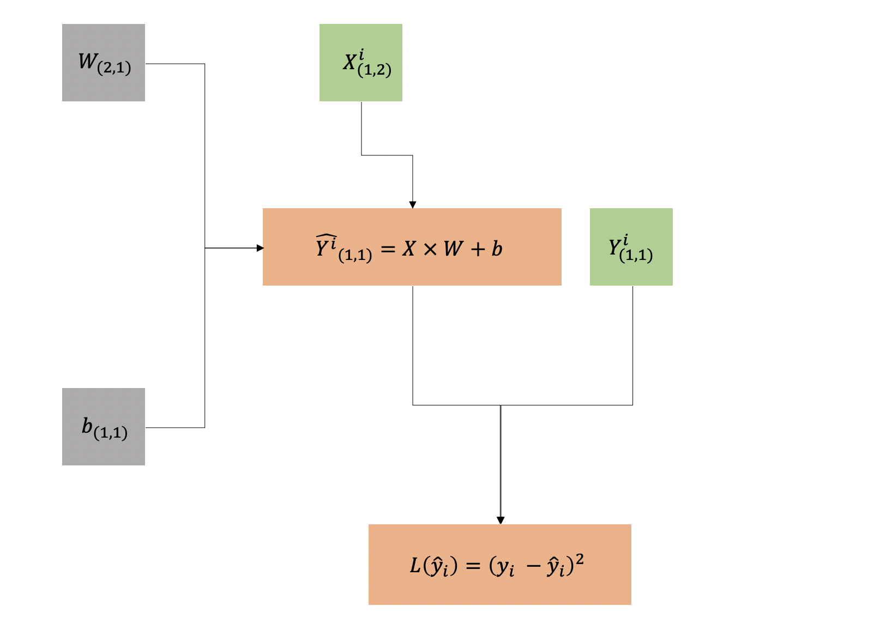
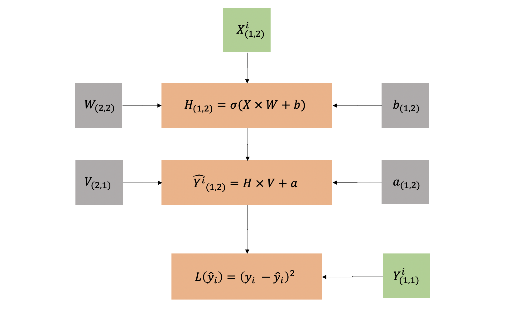
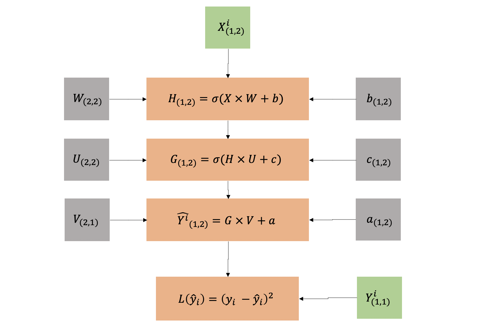
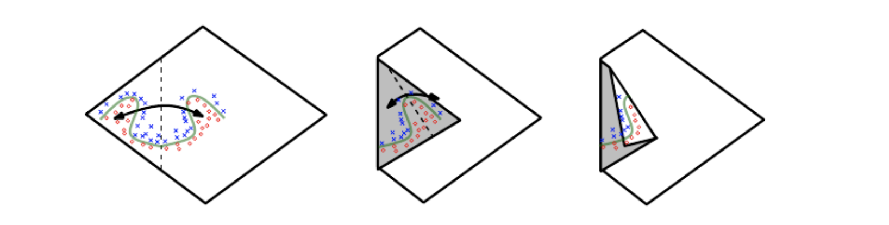

class: middle, center, inverse

# Introdução ao Deep Learning com R

### Curso-R

```{r setup, include=FALSE}
knitr::opts_chunk$set(eval = TRUE, echo = FALSE, 
                      dpi = 96, fig.height = 4.7, 
                      fig.width = 10, fig.retina = 3)
library(tidyverse)
```

---
## Nesse curso vamos falar de

TODO

---

## O que é Deep learning?

-   Subconjunto de técnicas de Machine Learning


Fonte: Deep Learning with R, Chollet, F et al

---
## O que é Deep learning?

- Aprender representações dos dados em camadas. Aprender representações dos dados 'hierarquicamente'. 


Fonte: Deep Learning with R, Chollet, F et al

---

## Por que Deep Learning

-   Estado da arte em diversos problemas muito importantes.


Fonte: [Apr. resultados ILSVRC 2017](http://image-net.org/challenges/talks_2017/ILSVRC2017_overview.pdf)

---

## Por que Deep learning?

- Resultados impressionantes em tradução.


Fonte: [A Neural Network for Machine Translation, at Production Scale](https://ai.googleblog.com/2016/09/a-neural-network-for-machine.html)
---

## Por que Deep Learning?

- Resultados em Reinforcement Learning


Fonte: [AlphaZero: Shedding new light on chess, shogi, and Go](https://deepmind.com/blog/article/alphazero-shedding-new-light-grand-games-chess-shogi-and-go)

---

# Por que Deep Learning?

- Reconhecimento de fala
- Reconhecimento em vídeos


Fonte: [Tesla’s Deep Learning at Scale: Using Billions of Miles to Train Neural Networks](https://towardsdatascience.com/teslas-deep-learning-at-scale-7eed85b235d3)

---

class: middle, center, inverse

# Tudo começa com ....

## Regressão Linear

---

## Regressão Linear

Prevendo o preço de uma casa a partir do tamanho em metros quadrados.

```{r}
df <- tibble(
  m2 = rgamma(n = 100, scale = 5, shape = 20),
  preco = 100000 + (6200 + rnorm(n = 100, sd = 800)) * m2 
)

ggplot(df, aes(x = m2, y = preco)) +
  geom_point() +
  coord_cartesian(ylim = c(0, NA)) +
  scale_y_continuous(
    name = "Preço (em R$)",
    labels = scales::dollar_format(prefix = "R$", big.mark = ".", decimal.mark = ",")
    
    ) +
  scale_x_continuous(name = "Área (em mˆ2)") +
  geom_smooth(method = "lm", se = FALSE, formula = y ~ x)
```

---

## Definição do modelo

Definimos o modelo de regressão linear da seguinte forma:

$$\hat{y_i} = w \times x_i + b$$
- $y_i$: preço do imóvel $i$
- $x_i$: área do imóvel $i$

Poderíamos escrever

$$\hat{y_i} = f(x_i)$$

em que:

- $f(x) = w \times x + b$

Chamamos $f$ de **'layer'** (camada) na linguagem do Deep learning.

---

## Layers (Camadas)

- Uma **'layer'** é uma transformação dos dados que é
parametrizada por **pesos**. 

- 'Aprender', então, significa encontrar os melhores **pesos** para cada camada.

No exemplo:

$$f(x) = w \times x + b$$

Os pesos são $w$ e $b$.

- Essas camadas são os 'tijolos' do Deep Learning e existem diversas 'camadas'.

- A camada do exemplo é chamada de **'Densa'** ou **'Linear'**.

- Um modelo pode possuir uma ou mais dessas camadas.

---

# Regressão Linear


Fonte: Figura adaptada do Deep Learning with R, Chollet, F. et al.


**Objetivo**: encontrar os melhores 'pesos' para essa Layer.

---

## Função de perda

- Mede quanto o modelo está perto do que queremos que ele fique.

- No nosso caso, mede o quanto a previsão dada por $w \times x + b$ está perto de $y$, o verdadeiro valor daquele imóvel.

- Uma função de perda bastante usada é o **MSE** - Erro quadrático médio.

- O MSE é dado por:

$$L(\hat{y}) = \frac{1}{n}\sum_{i=1}^{n} (y_i - \hat{y_i})^2$$
- Podemos reescrever em função dos pesos:

$$L(w, b) = \frac{1}{n} \sum_{i=1}^{n} (y_i - w \times x_i - b)^2$$
---

## Função de perda em função do valor dos parâmetros

```{r}
mse <- function(w, b) {
  mean((df$preco - (df$m2*w + b))^2)
}

expand.grid(
  w = seq(from = -10000, to = 10000, length.out = 300),
  b = seq(from = -200000, to = 200000, length.out = 100)
) %>% 
  rowwise() %>% 
  mutate(mse = mse(w, b)) %>% 
  ggplot(aes(x = w, y = b, fill = mse)) +
  geom_bin2d(stat = "identity") +
  scale_fill_gradient(high = "blue", low = "white", trans = "log") +
  theme_minimal() +
  geom_point(
    data = data.frame(w = 6200, b = 100000),
    aes(x = w, y = b, fill = NULL),
    color = "red",
    size = 5
  )
```

---

## Função de perda


Fonte: Figura adaptada do Deep Learning with R, Chollet, F. et al.

- A **função de perda** nos diz, dado um valor para cada peso, o quão próximo estamos do valor esperado.

---

## Encontrando o mínimo da função de perda

Até agora:

- Vimos que nosso objetivo é minimizar a função de perda.
- Para isso precisamos encontrar o valor dos pesos que minimiza faz a função de perda ter o valor mínimo possível.

Agora:

- O processo de encontrar o mínimo de uma função é chamado de **otimização**. 
- Existem diversos algoritmos de otimização. Em geral eles são adequados ou não dependendo da função que você está otimizando.
- Em Deep Learning usamos algoritmos que são variações do **Gradient Descent** - método de descida do gradiente.

---

## Gradient Descent 

O **gradient descent** diz que se uma função $L(x)$ é diferenciável na vizinhança de um ponto $w$ então $L(x)$ decresce mais rapidamente se você andar de $w$ para uma direção contrária ao gradient de $L$ no ponto $w$. 

Em outras palavras, fazer $w - \nabla L(w)$ é a forma de caminhar o mais rápido possível para o mínimo de $L(x)$.


Fonte: [Gradient Descent](https://en.wikipedia.org/wiki/Gradient_descent)

---

## Gradient descent no exemplo

No nosso exemplo temos: 

$$L(w, b) = \frac{1}{n} \sum_{i=1}^{n} (y_i - w \times x_i - b)^2$$

Então para andar mais rápido para o mínimo de $L$ cada passo de $w$ e $b$ tem que ser calculado da seguinte forma:

$$w_{(k+1)} = w_{(k)} - \alpha \frac{\partial L}{\partial w} = w_{(k)} - \alpha \frac{1}{n}\sum_{i=1}^{n} (-2 \times x_i)(y_i - w \times x_i -b)$$

$$b_{(k+1)} = b_{(k)} - \alpha \frac{\partial L}{\partial b} = b_{(k)} - \alpha \frac{1}{n} \sum_{i=1}^{n} (-2)(y_i - w \times x_i -b)$$

**Calma!** vamos dissecar essas fórmulas.

---


## Otimizando

Esse é o diagrama geral que vale para os modelos que vamos implementar neste curso.


Fonte: Figura adaptada do Deep Learning with R, Chollet, F. et al.

---

## Grafo de computação

.pull-left[

- É útil representar modelo em um grafo de computação.
- **Cinza** são os pesos.
- **Verde** são os dados.
- **Laranja** são variáveis derivadas de dados & pesos.

]

.pull-right[

]


---

## Calculando as derivadas

.pull-left[

1. Calculamos as derivadas parciais para cada transformação.
2. Usamos a regra da cadeia para calcular as derivadas $\frac{\partial L}{\partial w}$ e $\frac{\partial L}{\partial b}$.

Pela regra da cadeia temos:

$$\frac{\partial L}{\partial w} = 2(y_i - \hat{y}) \times x_i$$

$$\frac{\partial L}{\partial b} = 2(y_i - \hat{y}) \times 1$$

**Nota**: tiramos as médias p/ simplicar a notação.

]

.pull-right[

]

---

## Gradient descent

No fim temos que a regra de atualização dos pesos é:

$$w_{(k+1)} = w_{(k)} - \alpha \times \frac{1}{n} \sum_{i = 1}^n \left( 2(y_i - \hat{y}) \times x_i \right)$$

$$b_{(k+1)} = b_{(k)} - \alpha \times \frac{1}{n} \sum_{i = 1}^n \left( 2(y_i - \hat{y}) \times 1 \right)$$
- $\alpha$ é um hiper parâmetro que chamamos de **'learning rate'**. Ele controla com qual intensidade vamos andar na direção do gradiente.

- Na fórmula vemos que podemos obter $w_{(i+1)}$  em função do $w_{(i)}$, mas e o $w_{(0)}$? Geralmente inicializamos ele com algum número aleatório. A mesma coisa para o $b_{(0)}$.

---

## Gradient descent

- **Esquerda** eixos $b$ e $m$ representam $b$ e $w$ no nosso exemplo. O eixo 'Error' representa o valor da função de perda.

- Conseguimos visualizar a descida até o mínimo da função de perda pelo método do gradiente. 

- Na **direita** a reta ajustada para os dados.


Fonte: [https://alykhantejani.github.io/images/gradient_descent_line_graph.gif](https://alykhantejani.github.io/images/gradient_descent_line_graph.gif)

---

class: center, middle

exemplo 01: exemplos/01-linear-regression.R

---

## Exercício 1

Arquivo: exercicios/01-linear-regression.R


---

## SGD (Stochastic gradient descent)

- Em vez de calcular a média da derivada em todos os exemplos da base de dados, calculamos em apenas 1 e já andamos. Isto é, trocamos:

$$w_{(k+1)} = w_{(k)} - \alpha \times \frac{1}{n} \sum_{i = 1}^n \left( 2(y_i - \hat{y}) \times x_i \right)$$

por

$$w_{(k+1)} = w_{(k)} - \alpha \times \left( 2(y_i - \hat{y}) \times x_i \right)$$

- Cada vez que atravessamos a base inteira dessa forma chamamos de **'epoch'**.

- Agora é possível atualizar os pesos sem precisar fazer contas na base inteira. Mais **rápido**.

- Como estimamos o passo com apenas uma observação, os passos (principalmente quando já estão perto do mínimo) podem ser meio ruins.

---

## SGD

- Na prática, parece que o fato dos passos serem ruins perto do mínimo é bom - isso faz um certo tipo de regularização. Não se sabe explicar esse comportamento muito bem ainda.


Fonte: https://www.stat.cmu.edu/~ryantibs/convexopt/lectures/stochastic-gd.pdf

---

## Mini-batch SGD

- Em cada iteração, selecionamos uma amostra de tamanho $b$ da base de tamanho $n$. Em geral $b << n$. 

- Calculamos o passo do GD com essa amostra. No final temos:

$$w_{(k+1)} = w_{(k)} - \alpha \times \frac{1}{b} \sum_{i = 1}^b \left( 2(y_i - \hat{y}) \times x_i \right)$$

- Na prática é o que funciona melhor. Compensa o passo do SGD ser meio ruim por se basear em apenas uma observação e o fato do GD ser muito pesado computacionalmente para bases muito grandes.

- Em geral usa-se $b$ (**batch size**) múltiplos de 2.

---

## Mini-batch SGD

.pull-left[

]

.pull-right[

]

Fonte: https://www.stat.cmu.edu/~ryantibs/convexopt/lectures/stochastic-gd.pdf

---

class: middle, center

exemplo 02: exemplos/02-sgd.R

---

class: middle, center

exercicio 02: exercicios/02-mini-batch-sgd.R

---

## TensorFlow

- Biblioteca open-source para cálculos numéricos.
- Desenvolvida incialmente pela Google.
- Foco em Machine Learning e principalmente Deep Learning.
- Muito rápido - implementado para diversos hardwares como GPU's e até TPU's.
- Feature: **Automatic Differentiation**!
- Um grande ecossistema de addosn e extensões.
- Biblioteca mais utilizada para fazer Deep Learning atualmente.


---

## Keras

- É uma biblioteca open-source criada para especificar modelos de Deep Learning
- Foi criada antes do TensorFlow existir
- Funciona com múltiplos 'backends' - exemplo Theano, CNTK e PlaidML
- Foi **incorporada pelo TensorFlow** e à partir do 2.0 é a forma recomendada de
especificar modelos no TensorFlow


---

## TensorFlow e Keras no R

- TensorFlow e Keras são [implementados no R usando o 'reticulate'](https://blogs.rstudio.com/tensorflow/posts/2019-08-29-using-tf-from-r/), isso significa que chamamos funções do Python. 

- Keras para o R fornece uma API muito mais *user fiendly* para quem já programa em R e quer aprender Deep Learning.

- Muitos guias e tutoriais [aqui](https://tensorflow.rstudio.com/).

- A performance é comparável com a do Python - as contas pesadas acontecem no C++. 

- A comunidade é menor -> tem seus prós e contras.


---

class: middle, center

exemplo 03: exemplos/03-keras.R

---

class: middle, center

exercício 03: exercicios/03-keras-linear-regression.R

---

## Multi-layer perceptron (MLP)

- Essa imagem é uma das primeiras a passar pela cabeça quando falam sobre redes neurais.


Fonte: https://www.researchgate.net/figure/A-hypothetical-example-of-Multilayer-Perceptron-Network_fig4_303875065

---

## Notação matricial

Escrever na forma escalar é mais fácil para exemplos mais simples mas,
para exemplos um pouco mais avançados começa a ficar muito confusa.

.center[

]

---

## Notação matricial

Re-escrevemos o modelo anterior usando a notação matricial.
Veja que temos um pouco menos de caixinhas. Fica mais fácil
de ler.

.center[

]

---

## MLP

.pull-left[

- Ao lado temos a representação do grafo computacional de um MLP com uma camada escondida ('hidden layer') com 2 neurônios.

- $\sigma$ é uma **função de ativação**, reposável por adicionar não linearidades ao modelo.

- O número de colunas da matriz de pesos $W$ é o número de **'hidden units'**.

- A matrix $H$ é o que chamamos de **'hidden units'**.

]

.pull-right[


]

---

## MLP

Vamos escrever a fórmula para calcular a previsão para uma observação $i$,  $\hat{y_i}$. Considere: 
 
$W  = \begin{bmatrix}w_{11} & w_{12}\\w_{21} & w_{22}\end{bmatrix}$

$b = \begin{bmatrix}b_{11} & b_{12}\end{bmatrix}$

$V = \begin{bmatrix}v_{11} & v_{12}\end{bmatrix}$

$a = \begin{bmatrix}a_{11}\end{bmatrix}$

Então temos que

$$\hat{y_i} = v_{11}\sigma(w_{11} * x_{i1} + w_{21} * x_{i2} + b_{11}) + v_{12}\sigma(w_{12} * x_{i1} + w_{22} * x_{i2} + b_{12}) + a_{11}$$
---

## MLP

.pull-left[

- Agora acrescentamos mais uma camada no nosso modelo.

- Cada camada pode ter uma função $\sigma$ diferente.

- Cada camada pode ter um número de unidades diferente também.

]

.pull-right[



]

---

## MLP

A ideia de usar camadas surge da seguinte forma:

- Um modelo linear só pode, por definição, representar funções lineares.

- A seguir veio a ideia de criar modelos específicos para cada tipo de não linearidade que é estudada. Modelos exponenciais, modelos logistios, etc.

- Teorema da aproximação universal (Hornik et al.) fala que um MLP com uma camada com uma função de ativação que achata as entradas, pode aproximar qualquer função desde que ela tenha um número suficiente de **'hidden units'**.

- Na prática isso não funciona muito bem porque o número de **'hidden units'** pode ter que ser muito grande - então esbarramos na quantidade de dados disponível.

---

### MLP

- A ideia a seguir foi usar várias camadas, ao invés de uma.

- Várias funções podem ser aproximadas com uma quantidade menor de *hidden units* se a **arquitetura** tiver mais camadas.



Fonte: [Deep Learning Book - capítulo 6](https://www.deeplearningbook.org/contents/mlp.html)

---

## Hidden units

Existem duas escolhas com relação às **'hidden units'**:

1. Qual é o número de hidden units? Em geral isso é uma função do tamanho da matrix $X$. Não existe uma regra de ouro para escolher isso, é preciso testar diversos tamanhos e ver qual fica melhor.

2. A **função de ativação** é a parte mais importante. Em geral **rectified linear units** são a primeira coisa para testar. 

A seguir vamos conhecer algumas das funções de ativação mais utilizadas. Antes disso, vale a pena lembrar alguns pontos.

- As funções de ativação entram na conta do gradiente e portanto precisam ser deriváveis (pelo menos na maioria dos pontos).

- Descobrir qual função de ativação vai funcionar é também uma área de pesquisa ativa, e em geral é necessário testar várias versões para descobrir qual fica melhor.

---

## Rectified Linear Units (ReLu)

.pull-left[

- Usamos a função de ativação $\sigma(z) = max\{0, z\}$.

- A ideia do ReLu é ser fácil de otimizar, porque é muito parecido com simplesmente não ter ativação (ativação linear).

- As derivadas são altas quando a unidade é importante, isto é, quando o output é alto.

- A segunda derivada não tem muita influencia pois ou é zero ou um.

- Ver capítulo [6.3.1 do Deep Learning Book](https://www.deeplearningbook.org/contents/mlp.html) para outras extensões.

]

.pull-right[
```{r, fig.width=5}
tibble(
  x = seq(-1, 1, length.out = 100),
  y = pmax(0, x)
) %>% 
  ggplot(aes(x = x, y = y)) +
  geom_line() +
  theme_minimal()
```
]


